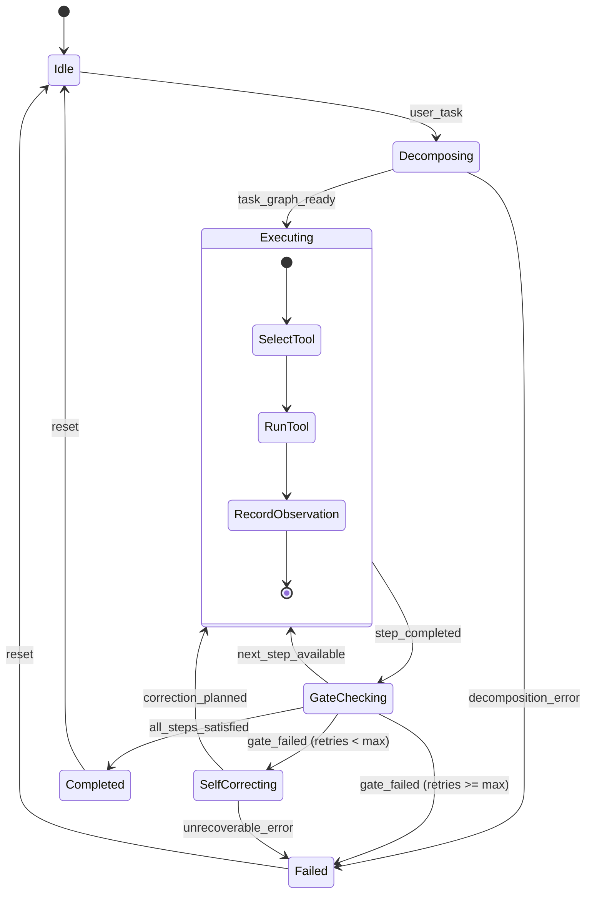

# BIT On-Device Agent Harness Specification

This document instructs an AI agent on how to implement a production-ready, on-device **Dynamic DAG / State-Machine Agent Harness** for the BIT Android application (`com.bit`).

---

## 1. Overview & Goal

Build an autonomous on-device Agent Harness (`com.bit.agent.harness`) in Kotlin that executes multi-step tasks locally using BIT's LLM inference engine (`LlmProvider` / `GGUFEngine`), bounded by a phase-driven finite state machine (DAG) with explicit validation gates and self-correction recovery loops.

### Key Tenets
1. **Zero Unnecessary Dependencies**: Use existing Kotlin Coroutines, Flows, Kotlinx Serialization, and native Android APIs.
2. **Phase-Driven State Machine**: Bounded DAG transitions (`Decompose` → `Execute` → `GateCheck` → `SelfCorrect` → `Done`).
3. **Structured Observation Contracts**: Standardized tool observation envelopes with status, summary, artifacts, and recovery hints.
4. **Context Budget Enforcement**: Enforce turn limits, token compaction, and tool output truncation on local mobile models.

---

## 2. Target Architecture



---

## 3. Core Components to Implement

### A. State Machine Models (`com.bit.agent.harness.state`)

```kotlin
package com.bit.agent.harness.state

import com.bit.api.StreamEvent
import com.bit.api.ToolCallRequest

sealed class AgentHarnessState {
    object Idle : AgentHarnessState()
    
    data class Decomposing(val prompt: String, val attempt: Int = 1) : AgentHarnessState()
    
    data class Executing(
        val activeStep: TaskStep,
        val toolCall: ToolCallRequest?,
        val stepIndex: Int,
        val totalSteps: Int
    ) : AgentHarnessState()
    
    data class GateChecking(
        val step: TaskStep,
        val observation: ToolObservation,
        val passed: Boolean
    ) : AgentHarnessState()
    
    data class SelfCorrecting(
        val failedStep: TaskStep,
        val rootCause: String,
        val retryCount: Int,
        val maxRetries: Int = 3
    ) : AgentHarnessState()
    
    data class Completed(
        val finalResult: String,
        val artifacts: List<String>,
        val totalTurns: Int
    ) : AgentHarnessState()
    
    data class Failed(
        val reason: String,
        val step: TaskStep? = null
    ) : AgentHarnessState()
}

data class TaskPlan(
    val goal: String,
    val steps: MutableList<TaskStep>
)

data class TaskStep(
    val id: String,
    val description: String,
    val toolName: String,
    val expectedOutcome: String,
    var status: StepStatus = StepStatus.PENDING,
    var observation: ToolObservation? = null,
    var retryCount: Int = 0
)

enum class StepStatus { PENDING, RUNNING, PASSED, FAILED, SKIPPED }
```

---

### B. Standard Observation Contract (`com.bit.agent.harness.model`)

Every tool execution must return a standardized JSON/Data structure:

```kotlin
package com.bit.agent.harness.model

import kotlinx.serialization.Serializable

@Serializable
data class ToolObservation(
    val status: ObservationStatus,       // SUCCESS, WARNING, ERROR
    val summary: String,                  // Single line concise outcome
    val payload: String? = null,          // Actual data / file content / search snippet
    val artifacts: List<String> = emptyList(), // File paths / URLs touched
    val recoveryHint: String? = null      // Actionable hint if status is ERROR/WARNING
)

enum class ObservationStatus { SUCCESS, WARNING, ERROR }
```

---

### C. Tool Registry & Action Space (`com.bit.agent.harness.tools`)

Implement `AgentTool` interface and register tools across the 3 core domains:

#### 1. Interface
```kotlin
package com.bit.agent.harness.tools

import com.bit.api.ToolDefinition
import com.bit.agent.harness.model.ToolObservation

interface AgentTool {
    val definition: ToolDefinition
    suspend fun execute(argumentsJson: String): ToolObservation
}
```

#### 2. Tool Suites
1. **Workspace & File System Tools**:
   - `file_read(path: String, start_line: Int?, end_line: Int?)`
   - `file_write(path: String, content: String, overwrite: Boolean)`
   - `file_patch(path: String, target_chunk: String, replacement_chunk: String)`
   - `dir_list(path: String, recursive: Boolean)`

2. **Web Search & Grounding Tools**:
   - `web_search(query: String, max_results: Int)`
   - `web_fetch(url: String, extract_markdown: Boolean)`

3. **RAG & Memory Vault Tools**:
   - `vault_query(query: String, top_k: Int)`
   - `vault_remember(key: String, facts: List<String>)`
   - `rag_search_docs(query: String, collection: String?)`

---

### D. Harness Executor Engine (`com.bit.agent.harness.engine`)

Implement `AgentHarnessEngine` running as a reactive Kotlin coroutine pipeline:

```kotlin
package com.bit.agent.harness.engine

import com.bit.agent.harness.model.*
import com.bit.agent.harness.state.AgentHarnessState
import com.bit.agent.harness.tools.AgentToolRegistry
import com.bit.api.LlmProvider
import kotlinx.coroutines.flow.MutableStateFlow
import kotlinx.coroutines.flow.StateFlow
import kotlinx.coroutines.flow.asStateFlow
import javax.inject.Inject
import javax.inject.Singleton

@Singleton
class AgentHarnessEngine @Inject constructor(
    private val toolRegistry: AgentToolRegistry,
    private val llmProvider: LlmProvider
) {
    private val _state = MutableStateFlow<AgentHarnessState>(AgentHarnessState.Idle)
    val state: StateFlow<AgentHarnessState> = _state.asStateFlow()

    suspend fun executeGoal(userGoal: String, maxSteps: Int = 10, maxRetriesPerStep: Int = 3): AgentHarnessState {
        // Step 1: Decompose Goal into DAG Plan
        // Step 2: Loop through Plan Steps
        // Step 3: Run Tool & Collect Observation
        // Step 4: Gate Check (Verify Observation against Expected Outcome)
        // Step 5: Self-Correction if Gate Fails
        // Step 6: Finalize Result
        // ...
    }
}
```

---

## 4. Implementation Steps for the Agent

When tasked with implementing this harness:

1. **Create Package Structure**:
   `com.bit.agent.harness`
   ├── `model/` (Observations, TaskPlans, Schemas)
   ├── `state/` (State Machine & sealed classes)
   ├── `tools/` (AgentTool interface, WorkspaceTools, WebTools, VaultTools, AgentToolRegistry)
   ├── `gate/` (ObservationValidator, SelfCorrectionPlanner)
   └── `engine/` (AgentHarnessEngine, HarnessConfig)

2. **Hook with Existing BIT Services**:
   - Reuse `com.bit.vault.VaultHelper` for memory operations.
   - Reuse `com.bit.workspace.WorkspaceProcessManager` or sandbox storage for file ops.
   - Reuse `com.bit.api.LlmProvider` and `com.bit.api.ToolDefinition`.

3. **Context Budgeting Rules**:
   - Cap tool output responses to **800 tokens / 3000 chars** per observation.
   - Strip unnecessary JSON noise before appending observation to conversation history.
   - If an error occurs, include `recoveryHint` directly in the next prompt turn.

4. **Self-Correction & Loop Guard**:
   - Set max global step limit (default: 10).
   - Set max retries per single failed step (default: 3).
   - If repeated failure occurs on the same step, force alternative tool strategy or fail gracefully.

5. **Unit & Integration Verification**:
   - Add unit tests in `app/src/test/java/com/bit/agent/harness/AgentHarnessTest.kt`.
   - Test DAG state transitions: Idle → Decompose → Execute → GateCheck → Completed.
   - Test Gate failure → SelfCorrect → Retry → Success.

---

## 5. Verification Checklist

- [ ] All tool inputs and outputs follow strict Kotlinx serialization data classes.
- [ ] No unhandled exceptions escape the tool execution boundary (wrap with `ToolObservation(status = ERROR, ...)`).
- [ ] Harness emits reactive StateFlow events so the Android Compose UI can render step progress.
- [ ] Tests pass without requiring physical device hardware (mocked LLM stream events).
