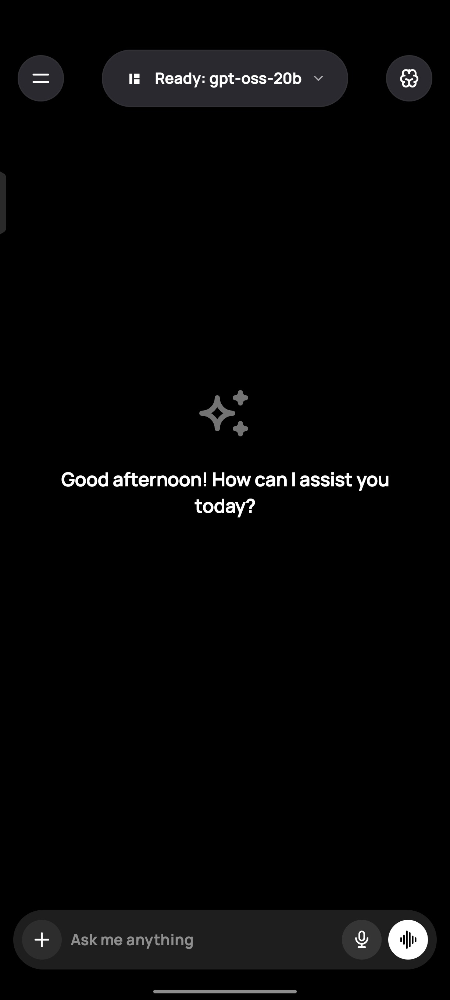
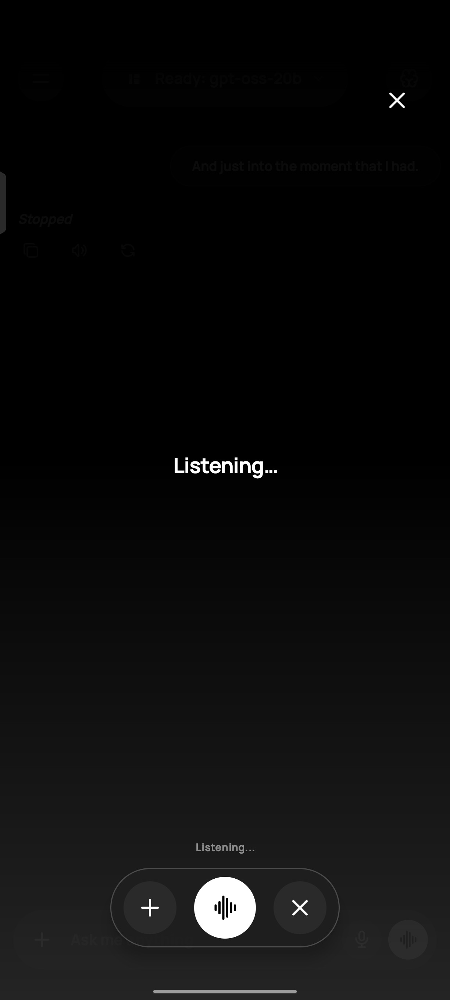
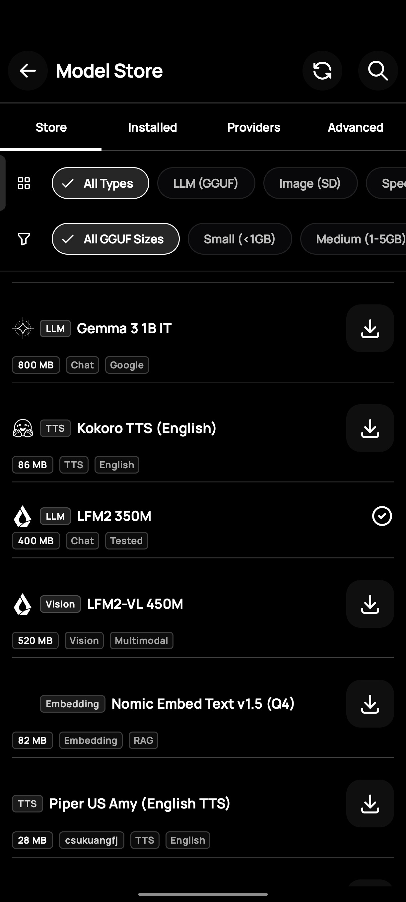
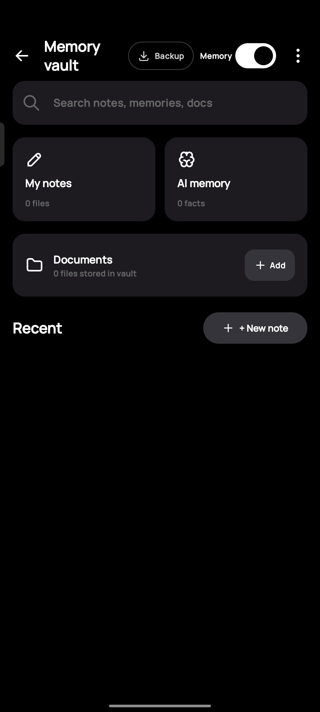
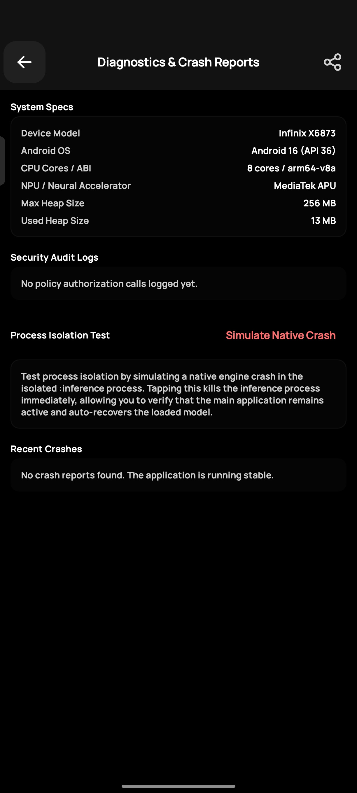
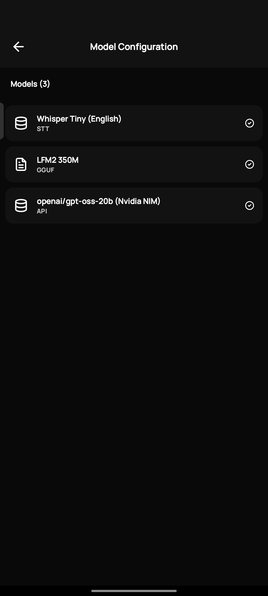

# BIT — On-Device AI Assistant for Android

<p align="center">
  
</p>

<p align="center">
  <a href="https://github.com/jaswanthsanjay88/Bit_Android/releases/latest"></a>
  <a href="fdroid/com.bit.yml"></a>
  <a href="LICENSE"></a>
  
  
  <a href="https://github.com/jaswanthsanjay88/Bit_Android/stargazers"></a>
</p>

BIT is a privacy-first AI assistant that runs large language models, vision models, image generation, document retrieval, and speech synthesis entirely on-device. No data leaves the phone. No cloud dependency. No subscription.

The application is built on top of the [llama.kt SDK](#the-llamakt-sdk), a modular Kotlin wrapper around native C++ inference backends, and targets Android 10 (API 29) and above.
---
[](https://www.buymeacoffee.com/jaswanthsanjay)
---

## Table of Contents

- [Overview](#overview)
- [Features](#features)
- [Architecture](#architecture)
- [The llama.kt SDK](#the-llamakt-sdk)
- [System Requirements](#system-requirements)
- [Downloads](#downloads)
- [Getting Started](#getting-started)
- [Building from Source](#building-from-source)
- [Contributing](#contributing)
- [License](#license)

---

## Overview

BIT enables users to run production-grade AI models directly on Android hardware. The project provides a complete mobile AI stack — text generation, visual understanding, structured tool calling, document search, long-term memory, and image synthesis — without requiring network connectivity or external API services.

All inference is performed locally using quantized GGUF model files. The application supports models from the Llama, Mistral, Gemma, Phi, and Qwen families, with native ARM64 and x86_64 acceleration.

---

## Application Screenshots

<p align="center">
  
  
  
</p>

<p align="center">
  
  
  
</p>

---

## Features

### Text Generation
Run quantized GGUF models locally via the llama.kt SDK. Supports multi-turn conversations with configurable sampling parameters (temperature, top-k, top-p, min-p), sliding-window context management, and low-latency token streaming through native JNI bindings.

### Vision Language Models
Analyze images on-device by loading CLIP vision projectors alongside text models. Supports image captioning, visual question answering, and document understanding without uploading content to external servers.

### Tool Calling
Execute structured tool calls with a two-stage routing pipeline. Stage 1 selects the target tool from compact function signatures. Stage 2 generates parameters constrained by GBNF grammars at the sampler level, guaranteeing valid JSON output regardless of model size. Supported tools include system diagnostics, arithmetic, notepad operations, and local file access.

### Image Generation
Generate images on-device using Stable Diffusion 1.5 with support for text-to-image, inpainting, and local upscaling. Runs entirely through native libraries without GPU cloud resources.

### Document Retrieval (RAG)
Query local PDF, Word, Excel, EPUB, and plain text files using a hybrid retrieval pipeline combining vector semantic search with BM25 full-text ranking. Documents are parsed, chunked, and indexed on-device using the neuron-packet format.

### Long-Term Memory
Extract and persist episodic memories across chat sessions using configurable decay curves. The memory-vault module stores facts, preferences, and contextual information that the assistant can recall in future conversations.

### Text-to-Speech
Synthesize speech on-device using ONNX Runtime with support for multiple voices and language configurations. No network calls are made during synthesis.

### Encrypted Backups
Export chat history, memories, model configurations, and settings to encrypted `.tnbackup` files. Encryption uses AES-256-GCM backed by the Android Keystore System.

### In-App Updates
Check for new releases from GitHub on app start. The update system supports skip-version persistence — dismissing an update prompt suppresses it until a newer release is published.

### API Mode
Connect to OpenAI-compatible API endpoints for cloud-hosted models alongside local inference. Useful for accessing larger models that exceed device memory constraints.

---

## Architecture

BIT is structured as a multi-module Android application. Native inference operations are isolated from the presentation layer to allow independent development and testing of each component.

| Module | Purpose |
|---|---|
| `app` | Main application module. Jetpack Compose UI, ViewModels, navigation graph, plugin system, and application state management. |
| `llama-kt` | Core inference SDK. Native JNI bindings for GGUF model inference, vision projector loading, grammar-constrained decoding, and sampler configuration. |
| `ums` | User Management System. Secure session handling and identity management. |
| `neuron-packet` | Parser and manager for encrypted local RAG document packets in the `.neuron` format. |
| `system_encryptor` | Cryptographic utilities providing AES-256-GCM encryption backed by the Android Keystore System. |
| `file_ops` | On-device file management, backup, and restore operations. |
| `memory-vault` | Long-term episodic memory storage engine with configurable decay and retrieval mechanisms. |

```
BIT (app)
 |
 +-- llama-kt (native LLM / VLM inference)
 |      +-- llama.cpp JNI bindings
 |      +-- GGUF model loading and context management
 |      +-- Grammar-constrained decoding (GBNF)
 |
 +-- ums (user management)
 +-- neuron-packet (encrypted RAG documents)
 +-- system_encryptor (AES-256-GCM / Android Keystore)
 +-- file_ops (file management and backups)
 +-- memory-vault (episodic memory engine)
```

---

## The llama.kt SDK

The llama.kt module is a self-contained Kotlin SDK that bridges Android application code to high-performance C++ inference backends. It provides:

- **Native llama.cpp Bindings** — Custom JNI layer executing inference for GGUF-formatted models with memory-mapped file loading and streaming token output.
- **Context and KV Cache Management** — Programmatic sliding-window eviction, prompt token estimation, and native memory lifecycle management through C++ pointer wrappers.
- **Multimodal Vision Support** — Loading CLIP vision projectors alongside text models to perform on-device image description and visual understanding.
- **Grammar-Constrained Decoding** — Runtime GBNF grammar generation from JSON schemas, applied at the logit level to guarantee structurally valid output for tool calling and structured generation.
- **Custom Sampler Configuration** — Granular control over temperature, top-k, top-p, min-p, and logit bias parameters passed directly to the native sampler stack.

---

## System Requirements

| Specification | Minimum | Recommended |
|---|---|---|
| Android Version | Android 10 (API 29) | Android 12 (API 31) or higher |
| Device RAM | 6 GB | 8 GB to 12 GB |
| Free Storage | 4 GB | 10 GB or higher |
| Processor Architecture | ARM64 or x86_64 | Snapdragon 8 Gen 1 or equivalent |

---

## Downloads

Pre-built APK binaries are available from the [Releases](https://github.com/jaswanthsanjay88/Bit_Android/releases/latest) page and F-Droid recipe metadata:

| Variant | Description | Recommended |
|---|---|---|
| `arm64-v8a` | ARM64 build for modern Android phones and tablets. Covers the majority of consumer devices. | Yes |
| `universal` | Fat binary containing both ARM64 and x86_64 native libraries. Larger file size. | |
| `x86_64` | Build for x86_64 devices and Android emulators. | |

Select the **arm64-v8a** variant unless you have a specific requirement for another architecture.

### F-Droid Package & Metadata
BIT is configured for automated F-Droid inclusion with Fastlane metadata at [`fastlane/metadata/android/en-US/`](fastlane/metadata/android/en-US/) and F-Droid recipe [`fdroid/com.bit.yml`](fdroid/com.bit.yml).
See [FDROID_SUBMISSION.md](FDROID_SUBMISSION.md) for full F-Droid repository build and submission instructions.

---

## Getting Started

### Installation

1. Download the appropriate APK from the [Releases](https://github.com/jaswanthsanjay88/Bit_Android/releases/latest) page.
2. Enable installation from unknown sources when prompted by the system.
3. Install and launch the application.

### Loading a Model

Models can be loaded through two methods:

- **In-App Model Store** — Open the navigation drawer, navigate to the Model Store, register a Hugging Face repository, and download a quantized GGUF model file directly to the device.
- **Manual Import** — Download a `.gguf` model file to device storage using any file manager or browser, then select it using the model picker within the application.

---

## Building from Source

Building BIT requires the Android SDK, NDK, and CMake. The project uses Gradle with Kotlin DSL for build configuration.

### 1. Clone the Repository

Clone with submodules to fetch the llama-kt native dependencies:

```bash
git clone --recursive https://github.com/jaswanthsanjay88/Bit_Android.git
cd Bit_Android
```

If the repository was cloned without the `--recursive` flag, initialize submodules manually:

```bash
git submodule update --init --recursive
```

### 2. Build

Build a debug variant:

```bash
./gradlew assembleDebug
```

Build signed release variants (splits output by architecture):

```bash
./gradlew assembleRelease
```

Release APKs are written to `app/build/outputs/apk/release/`. The build produces separate APKs for ARM64, x86_64, and a universal variant.

### 3. Run Tests

```bash
./gradlew test
```

---

## Contributing

Contributions are welcome. Please read the [Contributing Guide](CONTRIBUTING.md) before submitting a pull request.

If you encounter a bug or have a feature request, open an issue on the [issue tracker](https://github.com/jaswanthsanjay88/Bit_Android/issues). When reporting bugs, include the device model, Android version, and steps to reproduce the issue.

See [CONTRIBUTORS.md](CONTRIBUTORS.md) for a list of contributors to this project.

---

## License

```
Copyright 2024 Jaswanth Sanjay

Licensed under the Apache License, Version 2.0 (the "License");
you may not use this file except in compliance with the License.
You may obtain a copy of the License at

    http://www.apache.org/licenses/LICENSE-2.0

Unless required by applicable law or agreed to in writing, software
distributed under the License is distributed on an "AS IS" BASIS,
WITHOUT WARRANTIES OR CONDITIONS OF ANY KIND, either express or implied.
See the License for the specific language governing permissions and
limitations under the License.
```
